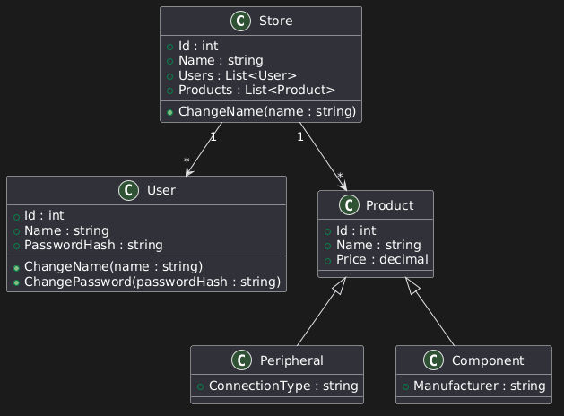

# TechStock

TechStock é um sistema de gerenciamento de estoque para uma loja de informática, desenvolvido inicialmente como uma aplicação Console em C#. O projeto utiliza conceitos de Programação Orientada a Objetos, incluindo herança, polimorfismo e abstração. A classe Product representa a base dos produtos, enquanto Peripheral e Component representam especializações. Periféricos incluem produtos como mouse, teclado e headset, enquanto componentes incluem processadores, memórias RAM e placas de vídeo. A classe Store representa a loja e mantém os produtos e usuários cadastrados no sistema. Inicialmente, os dados serão armazenados apenas em memória, permitindo focar na implementação das regras de negócio e na estrutura do sistema.

## Class Diagram

  

